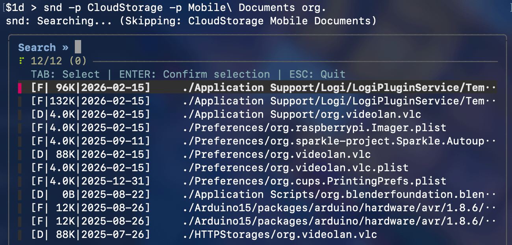

# 🗑️ Search & Destroy (`snd`) — for macOS

> Interactively find and delete files or directories by name — powered by [`fzf`](https://github.com/junegunn/fzf).


*↑ Replace with a screen recording or screenshot*

---

## Features

- 🔍 Case-insensitive search across files and directories
- 🎛️ Filter by type (file, directory, or both)
- 🚫 Ignore results matching a keyword
- ✂️ Prune entire directories from search (repeatable)
- 🧪 Dry run mode — preview what would be deleted
- ✅ Multi-select with TAB, confirm before any deletion

---

## Requirements

- macOS
- [`fzf`](https://github.com/junegunn/fzf) — install with `brew install fzf`

---

## Installation

```bash
curl -fsSL https://raw.githubusercontent.com/USERNAME/snd/main/install.sh | bash
```

You can inspect [`install.sh`](install.sh) before running — it downloads the latest release to `~/.local/bin` and ensures it's on your PATH.

After installation, open a new terminal or run:

```bash
source ~/.zshrc
```

---

## Usage

```
snd [OPTIONS] <STRING>
```

### Arguments

| Argument | Description |
|----------|-------------|
| `STRING` | String to match — e.g. `microsoft` creates the pattern `*microsoft*` |

### Options

| Flag | Description |
|------|-------------|
| `-t TYPE` | Search type: `f` (file), `d` (directory). Default: both |
| `-d` | Dry run — show what would be deleted without deleting |
| `-i STRING` | Ignore results whose name contains this string (e.g. `com.apple`) |
| `-p FOLDER` | Prune a directory from search entirely (repeatable: `-p dir1 -p dir2`) |
| `-h` | Display help and exit |
| `-v` | Display version and exit |

### Interface Controls

| Key | Action |
|-----|--------|
| `↑ ↓` | Move selection |
| `TAB` | Select / deselect item |
| `ENTER` | Confirm selection and delete |
| `ESC` | Quit without deleting |

---

## Examples

```bash
# Find files AND directories containing 'microsoft'
snd microsoft

# Find directories containing 'plugin' but not 'apple'
snd -t d -i apple plugin

# Find 'adobe' files, skipping CloudStorage and Dropbox directories
snd -p CloudStorage -p Dropbox adobe

# Dry run — preview what would be deleted
snd -d microsoft
```

---

## License

MIT © 2026 Yu-Sung Chang

---

## Releasing a New Version

Tag a commit and push — GitHub Actions handles the rest:

```bash
git tag v1.0.0
git push origin v1.0.0
```

The workflow will stamp the version, create a GitHub Release, and attach the binary automatically.